### Hi there 👋

I'm a developer who went though the Ops' world and became an SRE. I mainly work on CI stuff using Jenkins, Gradle, Kubernetes and Golang.

Currently working at @Criteo as a Senior SRE in the Build Services (Continuous Integration-related tooling) team.

